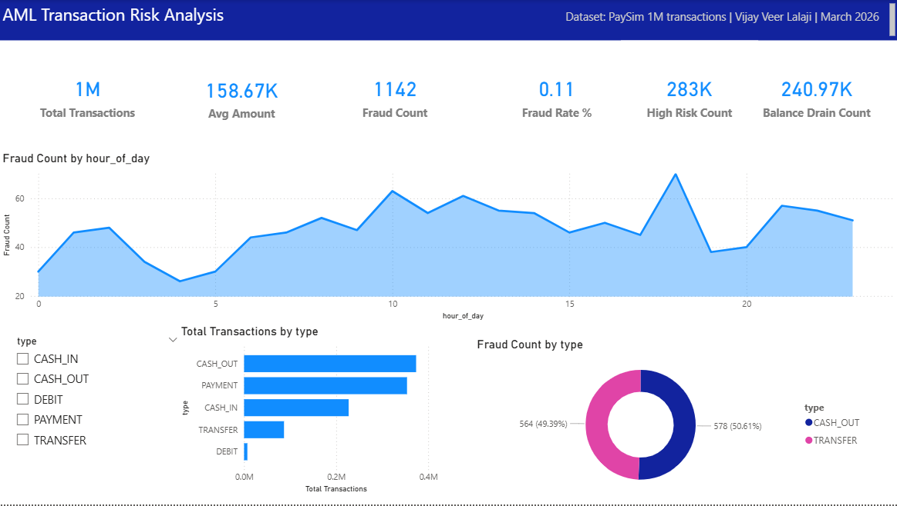
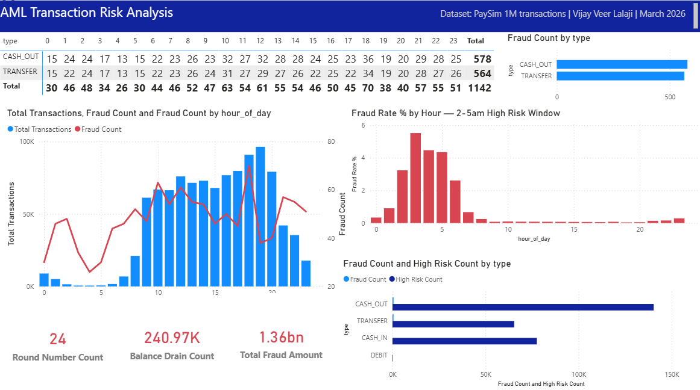
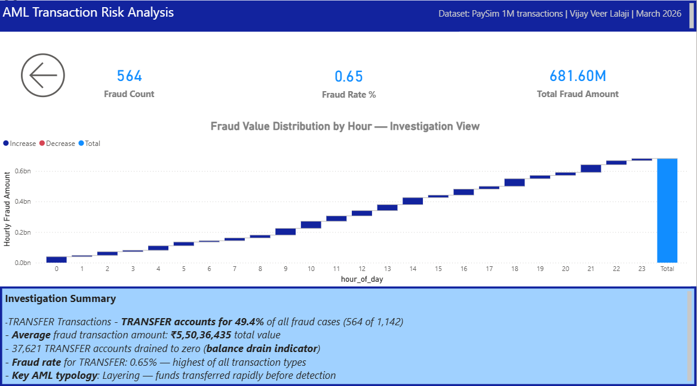

# AML Transaction Monitoring & Risk Segmentation Analysis

## Business Problem
Financial institutions process millions of transactions daily. 
Identifying suspicious activity manually is impossible at scale. 
This project builds an end-to-end AML risk detection framework 
applying real financial crime methodologies to 1M+ synthetic transactions.

## Dataset
- **Source:** PaySim Synthetic Financial Dataset (Kaggle)
- **Size:** 1,048,575 transactions across 5 transaction types
- **Labels:** isFraud and isFlaggedFraud flags included

## Tools Used
| Tool | Purpose |
|------|---------|
| Python (pandas, scikit-learn, matplotlib) | EDA, feature engineering, ML model |
| SQL (SQLite + window functions) | Risk queries, pattern detection |
| Advanced Excel (SUMPRODUCT, VLOOKUP) | Risk scoring, reconciliation model |
| Power BI (DAX, drill-through) | 3-page interactive dashboard |

## Key Findings
1. **TRANSFER and CASH_OUT = 100% of all fraud** — PAYMENT, DEBIT, CASH_IN have zero fraud
2. **Round number transactions: 58.33% fraud rate** — 536x higher than overall average of 0.11%
3. **Fraud peaks at 5.53% between hours 2–5am** vs 0.07% during daytime
4. **TRANSFER balance-drain fraud rate: 1.47%** — highest risk combination
5. **Logistic regression classifier: 99.89% accuracy** on 209,715 test records
6. **681.60M total fraud value** concentrated in TRANSFER transactions

## AML Typologies Identified
- **Structuring:** Round-number amounts (58.33% fraud rate confirms pattern)
- **Layering:** TRANSFER → rapid movement before detection (2–5am window)
- **Balance Draining:** 37,621 TRANSFER accounts emptied to zero in single transactions

## Project Outputs
- `Day1_AML_Python_Analysis.ipynb` — EDA, SQL queries, risk classifier
- `AML_Risk_Model.xlsx` — Excel risk scoring and reconciliation model  
- `AML_Dashboard.pbix` — Power BI 3-page dashboard
- `AML_Dashboard.pdf` — Dashboard export

## Dashboard Preview

## How to Run
1. Download PaySim dataset from [Kaggle](https://www.kaggle.com/datasets/ealaxi/paysim1)
2. Save as `kaggledataset.csv` in project folder
3. Update file path in Cell 2 of the notebook
4. Run all cells: Kernel → Restart and Run All

## Skills Demonstrated
`Python` `pandas` `scikit-learn` `SQL` `Window Functions` `Power BI` 
`DAX` `Advanced Excel` `SUMPRODUCT` `AML` `Financial Crime` 
`Logistic Regression` `Feature Engineering` `Data Visualisation`
